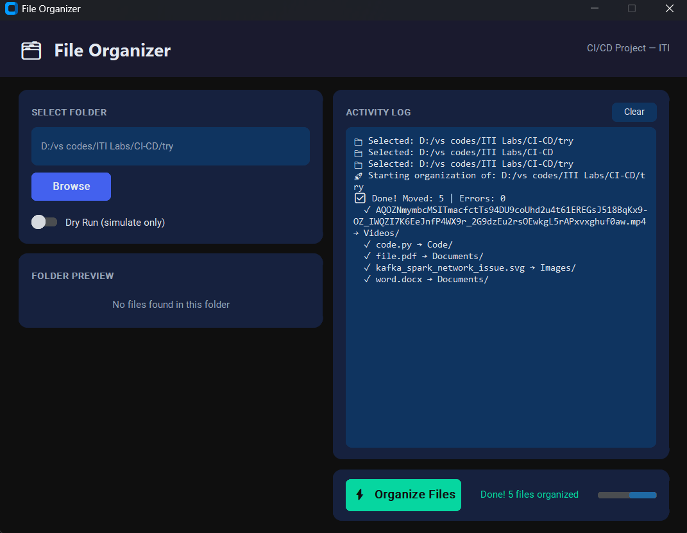

# 🗂 File Organizer — CI/CD Pipeline Project

> A Python desktop application that automatically organizes files into categorized folders,
> wired into a full Jenkins CI/CD pipeline.

---

## 📸 Features

- 🖥 **Modern Dark GUI** built with CustomTkinter
- 📁 Organizes files into: `Images`, `Videos`, `Audio`, `Documents`, `Code`, `Archives`, `Others`
- 🔍 **Folder Preview** — shows category breakdown before organizing
- ⚡ **Dry Run mode** — simulate without moving files
- 📝 Structured logging to `logs/organizer.log`
- 🧪 **32 unit tests** with pytest + coverage reporting

---

## 🛠 Tech Stack

| Tool | Purpose |
|---|---|
| Python 3.10+ | Core language |
| CustomTkinter | Modern dark-themed GUI |
| pytest + pytest-cov | Unit testing & coverage |
| flake8 | Code quality linting |
| Jenkins | CI/CD pipeline automation |
| Docker | Jenkins runtime environment |
| Git / GitHub | Version control & SCM trigger |

---

## 🔧 Jenkins Pipeline — 6 Stages

```
Stage 1 → Checkout          Pull source code from GitHub
Stage 2 → Setup Environment Install dependencies into venv
Stage 3 → Code Quality      flake8 linting check
Stage 4 → Tests             pytest + coverage report (≥80%)
Stage 5 → Headless Run      Validate core logic without GUI
Stage 6 → Archive Artifacts Save logs & coverage reports
```

---

## 📁 Project Structure

```
file-organizer/
├── src/
│   ├── __init__.py
│   ├── organizer.py      # Core business logic (pure functions)
│   └── app.py            # CustomTkinter GUI
├── tests/
│   ├── __init__.py
│   └── test_organizer.py # 32 unit tests
├── logs/                 # Auto-generated logs
├── Jenkinsfile           # Pipeline definition
├── requirements.txt
└── README.md
```

---

## 🚀 Quick Start

```bash
# Clone the repo
git clone https://github.com/<your-username>/file-organizer.git
cd file-organizer

# Install dependencies
pip install -r requirements.txt

# Run the app
python src/app.py

# Run tests locally
pytest tests/ -v --cov=src --cov-report=term-missing
```

---

## ⚙️ Jenkins Setup

1. Install Jenkins (Docker recommended)
2. Create a **Pipeline** job
3. Point SCM to this GitHub repo
4. Set `Jenkinsfile` as the pipeline script
5. Enable **GitHub webhook** for auto-trigger on push

```bash
# Run Jenkins via Docker
docker run -p 8080:8080 -p 50000:50000 \
  -v jenkins_home:/var/jenkins_home \
  jenkins/jenkins:lts
```

---

## 📊 Test Coverage

```
src/organizer.py    94% coverage
32 tests — all passing ✅
```

---
---

## 📊 GUI After running



---

## 👤 Author

**Mohamed Ashraf** — Data Engineering Track @ ITI
